# Spartan Fitness

[View the live project here.](https://deanburke.github.io/spartan-fitness/)

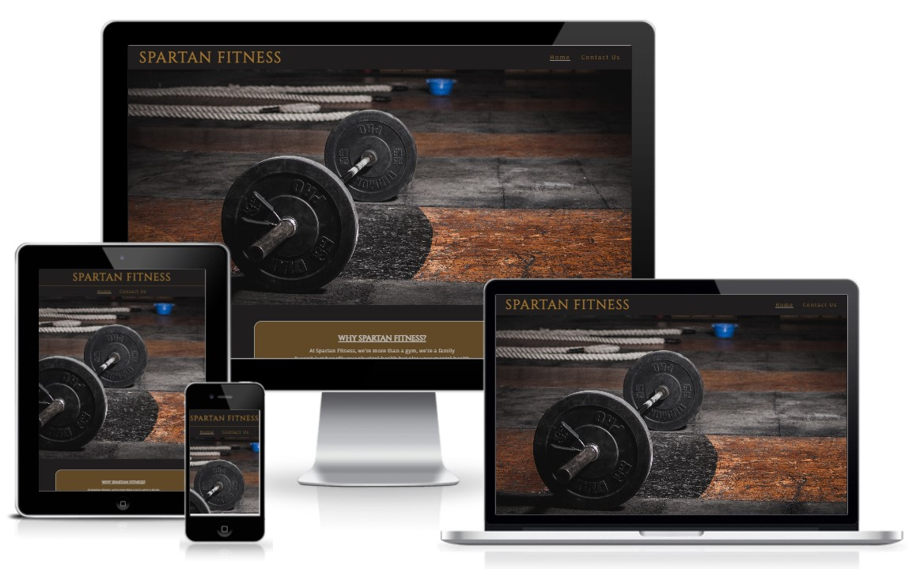

Welcome to Spartan Fitness! We are a gym that believes in the power of fitness to improve every aspect of your life. Our doors are open to people of all ages and sizes, and we are committed to creating a welcoming and inclusive environment where everyone can feel comfortable and supported as they work towards their fitness goals.

Whether you are a seasoned athlete or just starting out on your fitness journery, we have something for you at Spartan Fitness. So come on in, and let's get moving!

---

# User Experience (UX)

This website is designed to help users find out information on opening times and pricing, while giving a brief indication on the benefits of various training. It also gives users the chance to contact us and find out more about Spartan Fitness.

## Intended Audience

* Fitness enthusiasts looking for a new place to workout.
* People looking to improve their physical health and wellbeing.
* Individuals looking to lose weight.
* People seeking a supportive and welcoming community for the fitness journey.
* Seniors looking for a place to stay active and healthy.
* People seeking relief from stress or anxiety through exercise.

 

 # Design

 ## Wireframes

 Wireframes were created for the site with [Wireframe.cc](https://wireframe.cc/)

 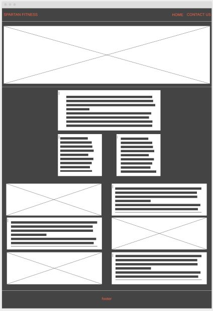 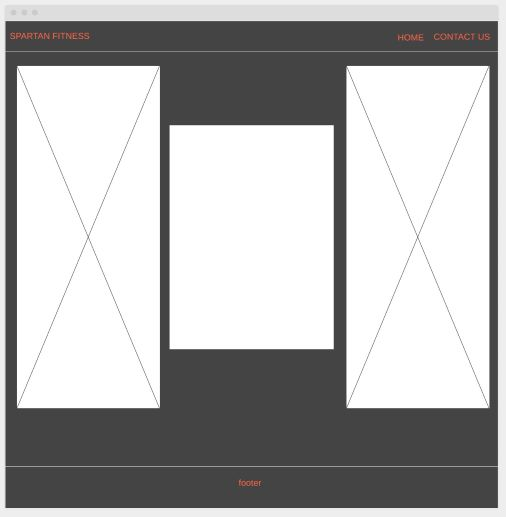
 
 Wireframes were done for both the home page and contact us page on desktop. 

 

 ## Colour Scheme

 The colour palette was created with the idea of a spartan helmet in mind, and also the toughness of what a gym and fitness can entail. 

 Colour palette was created using: 

 * [Colormind](http://colormind.io/)

 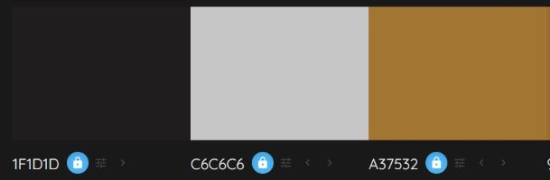

 An additional color using RGBA was used which was #A37532 with some opacity, i.e. `rgba(163, 117, 50, .5)`

 

 ## Typography

 Cinzel and Fauna One were chosen from [Google Fonts](https://fonts.google.com/) with the aid of [Font Pair](https://www.fontpair.co/).

 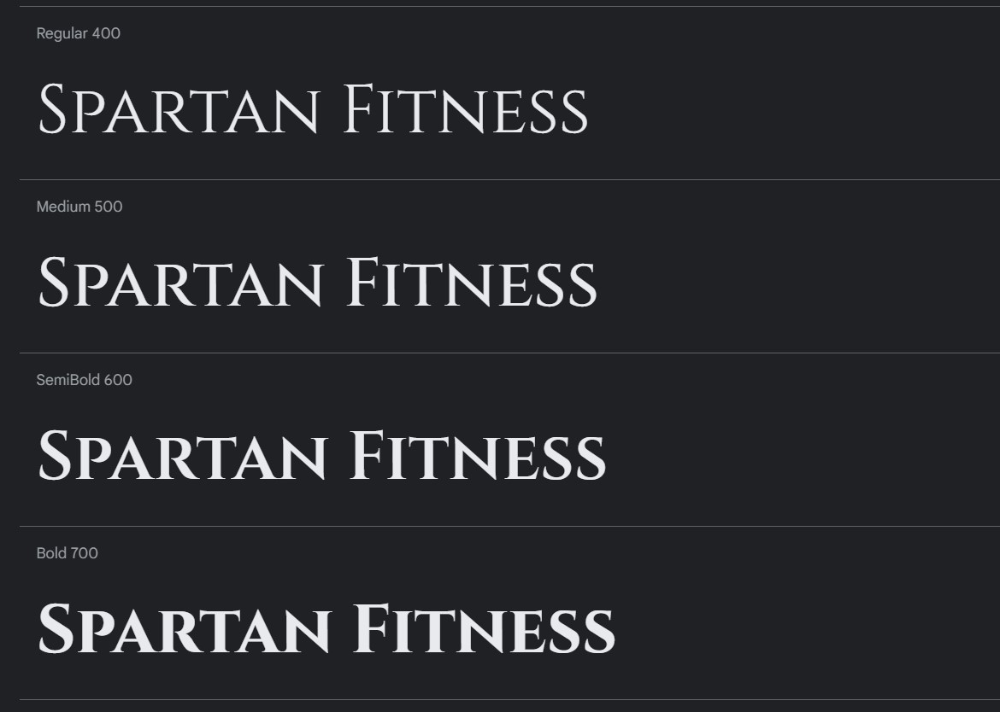

 

 ## Imagery

 Images are located on all pages. Under the navigation as the header/hero image, as aid with the benefits section on the home page and then on the contact us page also. 

 All images have been used from: 

 * [Pexels](https://www.pexels.com/)

 Icons were used for social links on the footer of both pages. The icons used on the site were taken from: 

 * [Font Awesome](https://fontawesome.com/)

 

 # Features

 ## Navigation

 * Featured at the top of the page and consistent throughout the website.
 * The nagivagtion shows the gym name in the left corner that links back to the home page.
 * The other navigation links are located to the right: Home and Conact Us which links to the specified page.
 * Cinzel font was used on the gym name, so as to stand out and contrast the navigation links on the right. Along with a color used for all links that contrast the background
 * The navigation bar is responsive across all media devices. 
 * An underline is displayed to show the current webpage the user is on.
 * When a navigation item is hovered over the background and text change to reverse the colours to show the user that this web page can be clicked on.

 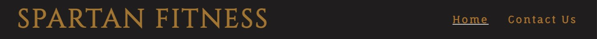  
 *Screenshot of navigation bar on desktop*

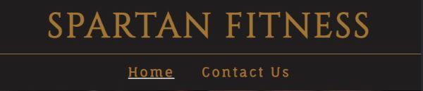  
 *Screenshot of navigation bar on mobile*

 

 ## Header image

 * The header image shows a barbell with plates on it lying on a wooden floor, this image is a powerful symbol to show users that you don't always need fancy equipment or programs to reach your goals. 

 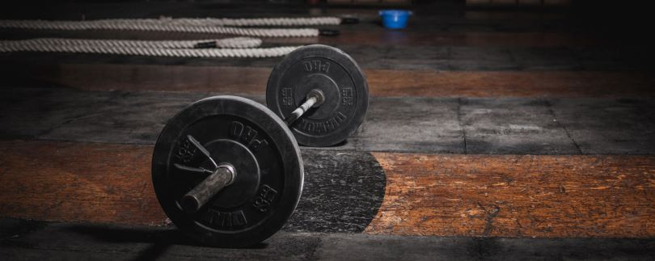

 

 ## Why Spartan Fitness section

 * The 'Why Spartan Fitnes?' section gives the user details of what the gym stands for and how it can help all people who are interesting in starting or continuing their fitness journey.
 * The colours of the background and text contrasted while keeping with the colour scheme of the website.
 * A border shadow was added to all content boxes on the home page to add depth and consistency.

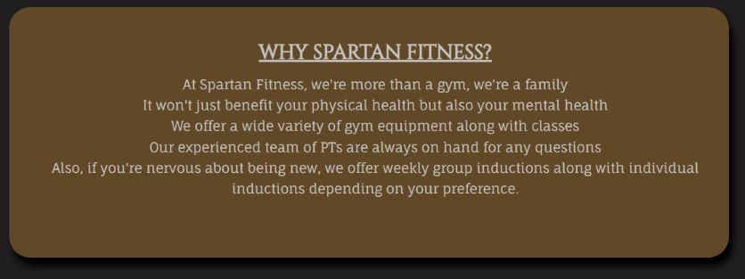

 

## Opening times and Pricing section

* The opening times and pricing section was created so as to give users a clear insight on important business information. 
* Content box styling consistent as mentioned in the [Why Spartan Fitness Section](#why-spartan-fitness-section).
* Using Flex CSS and media queries, I was able to create a consistent responsive design so as to not harm user experience.

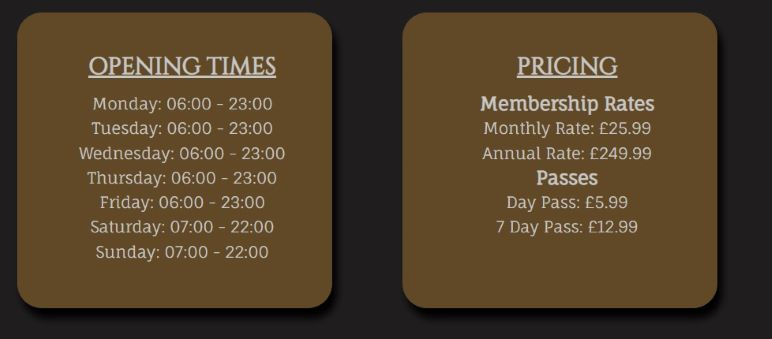

 

## Benefits section

* The 'Benefits of various training' section was designed to give users a brief look into what different types of training can help with.
* It was designed to pique user's interest to learn more training without overloading them with information. 
* Content box styling consistent as mentioned in the [Why Spartan Fitness Section](#why-spartan-fitness-section).
* The layout format was created with the below positioning in mind:
    * Image / Content
    * Content / Image
    * Image / Content
* Float CSS styling was used to complete this, and media queries were put in place to let the image/content flow smoothly on any device. 

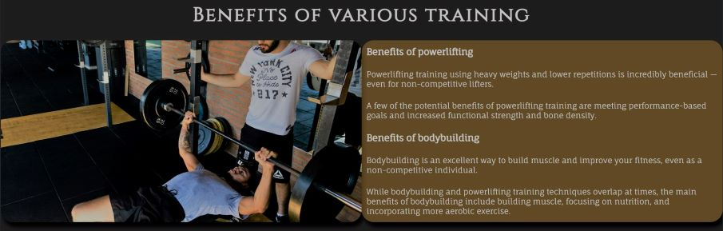  
*Screenshot of benefits section on desktop*

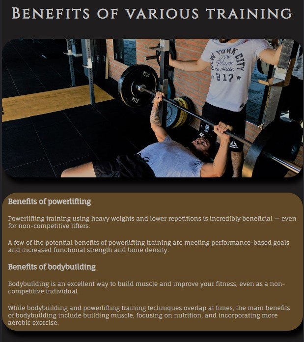  
 *Screenshot of benefits section on mobile*

  

 ## Footer

 * The footer of the website is designed to be minimalistic and include a number of links to the different social networks attached to Spartan Fitness.
 * These are displayed using icons obtained through [Font Awesome](https://fontawesome.com/).
 * These icons are clickable and will open up the respective social networks in a new page.
 * It also includes a Spartan Fitness copyright name along with clickable link for my LinkedIn page under 'Dean Burke'.
 

 

## Contact Us page

* The contact us page was designed in thirds, with two outer spartan helmets enclosing the contact form. 
* The form itself was created for users to get in touch about any queries or concerns they might have about joining. It can help to improve the user experience by providing a quick and convenient way to connect with the gym.
* When the user hovers over each text input box, the border will change to acknowledge which box is about to be selected. 
* Likewise when the user hovers over the submit button with changes color to signal to the user it is ready to click. 
* HTML rules were implemented so as to make sure no box is allowed to be submitted empty.
* Media queries were added to remove the images on smaller devices so as keep a smooth user experience.

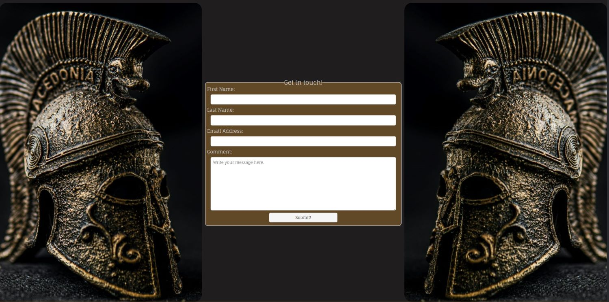  
*Screenshot of contact us section on desktop*

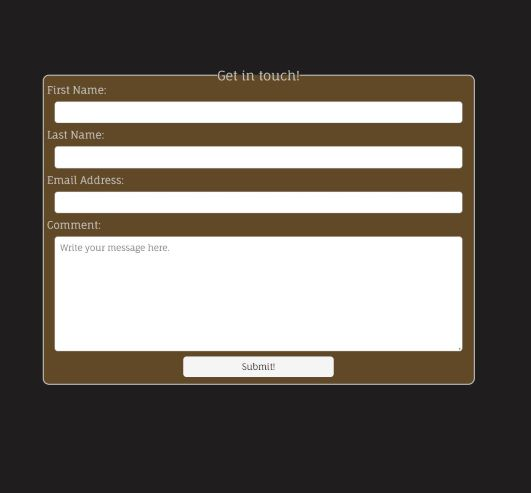  
*Screenshot of contact us section on mobile*

 

# Testing

There was a number of different tests done to ensure that website was working as it should:

* The website was tested on a number of different browsers:
    * Windows
        * Firefox on Windows 10 Pro
        * Chrome on Windows 10 Pro
    * Android
        * Chrome OnePlus 10
        * Chrome Samsung Galaxy S22
    * Apple iOS
        * Safari iPhone SE
* All features were tested as they were implemented such as clickable logos, navigation items directing the user to the correct location, the button itself changing colour as it should while being hovered etc.
* The form was tested to ensure that user had to enter information or they would be unable to submit their form response. 
* Once I had worked on the responsiveness of the website the layout of both pages were tested in Google Dev Tools, on a 26 inch laptop screen, on a Samsung Galaxy Tab S8 (11 inch display) and on a OnePlus 10.
* I used both [W3C Validator](https://validator.w3.org/#validate_by_input) and [Jigsaw Validator](https://jigsaw.w3.org/css-validator/#validate_by_input) to test my code to check for mistakes or errors.
* I used lighthouse to improve accessibility and perfomance, and compressed images that were causing long load times.

 

## Bugs

**Solved Bugs**

* When I initially implemented my header/hero image, it wasn't returning any image on the file. 
    * I accidentally had tabbed to select the background image as opposed to background
    * I amended the code, and it worked fine **background: url('../images/hero-image-compressed.jpg') no-repeat center center;**
* I incorrectly used empty Divs and styled them when trying to center infomation boxes (Opening Times & Pricing), which is bad practice.
    * I used flex CSS styling to amend this issue and fixed the problem.  
     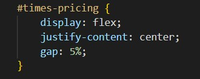
* When testing my code in [W3C Validator](https://validator.w3.org/#validate_by_input), it returned 2 bugs, I had used a section tag with no subsequent h element, this was then changed to a DIV tag. Also I had mistakenly used an ID selector twice in my code, this was changed to a Class selector and my styling was updated accordingly.

## Unfixed Bugs

No unfixed bugs

 

# Validating Testing

* HTML
    * No errors were returned when running my final test of [W3C Validator](https://validator.w3.org/#validate_by_input)
* CSS
    * No errors were returned when running my final test of [Jigsaw Validator](https://jigsaw.w3.org/css-validator/#validate_by_input)
* Accessibility
    * Using lighthouse in Chrome Dev Tools, I confirmed that colors and fonts were readable against backgrounds.  
     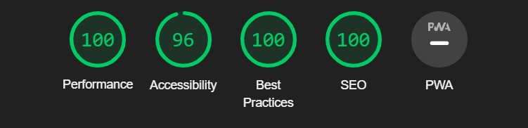

 

# Deployment

The site was deployed to GitHub pages. The following steps were used:

* Go to respositiory
* Click the Settings tab
* On the left hand column, click Pages under code and automation
* Under build and deployment, in the source box, ensure the 'Deploy from a branch' is selected.
* Then select main under the branch and click save
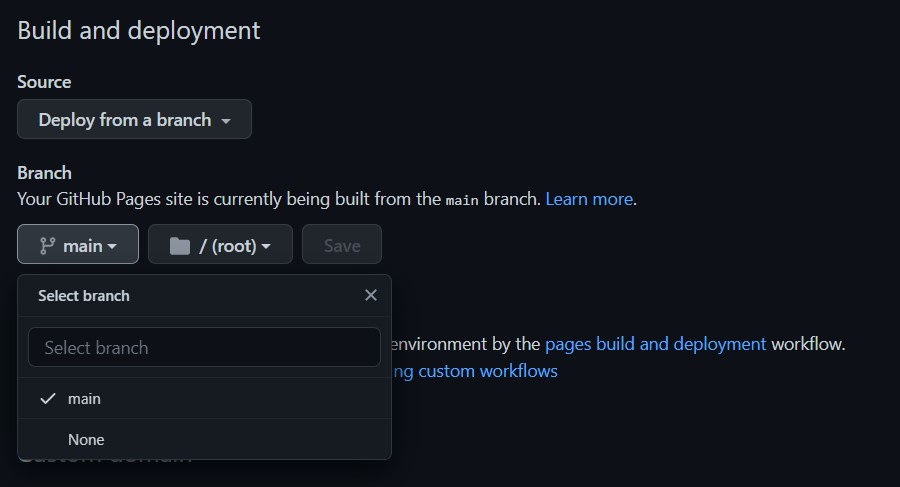
* It may take a few minutes, but when the page has been created you will see the following message.
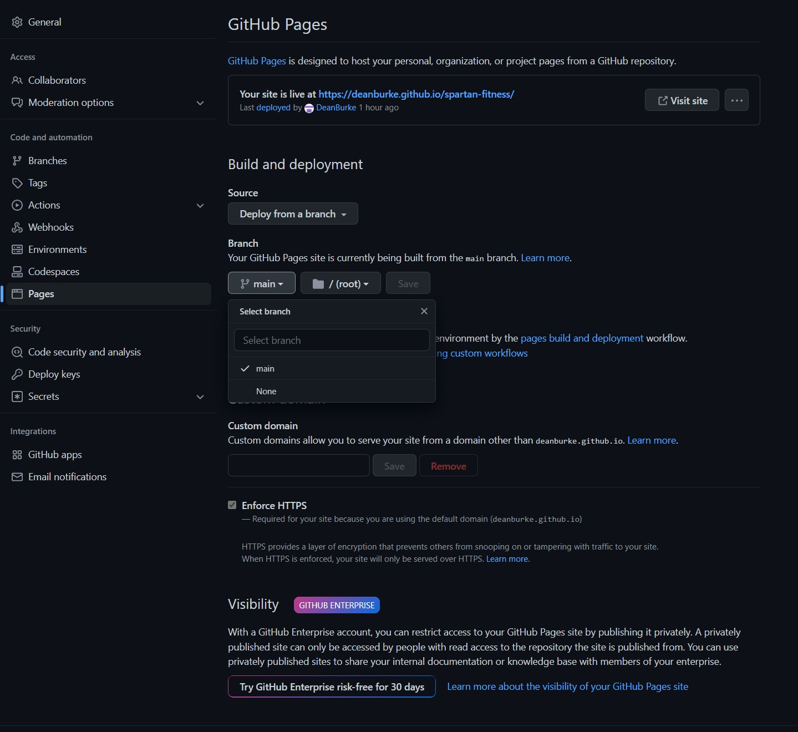

 

# Credits

* I used code I had learned from the love running project, with regards to my background image.
* I used [W3 Schools](https://www.w3schools.com/) for some help with regards to my form layout and also box shadowing on my content boxes.
    * This [article](https://www.w3schools.com/tags/tag_fieldset.asp) for help with my form
    * This [article](https://www.w3schools.com/cssref/css3_pr_box-shadow.php) for help with shadowing around my box.
* For the layout of my website I had to learn how to Flex CSS, this webite on [Flexbox](https://css-tricks.com/snippets/css/a-guide-to-flexbox/) helped a lot. 

## Content

* I used the following articles to help with the content for my [Benefits Section](#benefits-section)
    * Benefits of powerlifting and bodybuilding [article](https://www.healthline.com/nutrition/powerlifting-vs-bodybuilding)
    * Benefits of crossfit [article](https://www.healthline.com/health/exercise-fitness/crossfit-benefits#improve-agility)
    * Benefits of cardio [article](https://www.nike.com/a/cardio-hiit-difference)